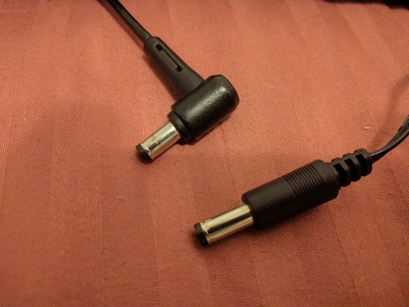
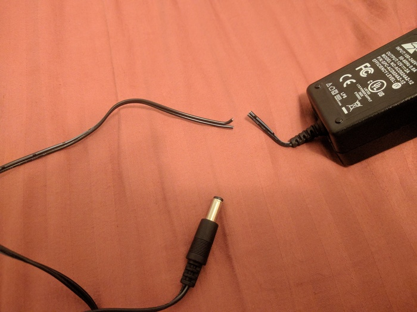
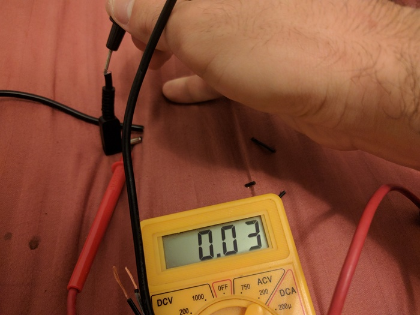
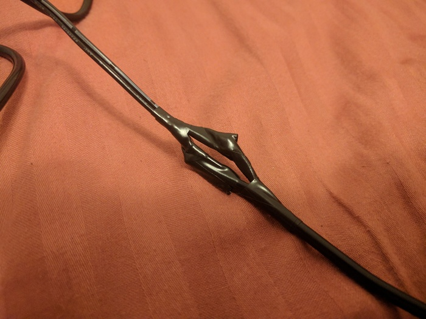
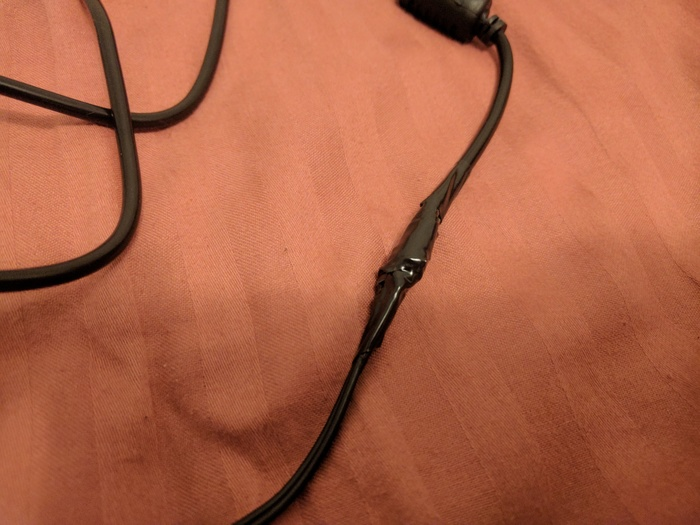

Title: How To Repair A Laptop Charger
Date: 2017-05-02 21:50
Category: Computers
Tags: laptop, charger
Slug: how-to-repair-a-laptop-charger
Authors: Romain Pellerin
Summary: How I replaced my defective laptop charger

A few months ago, my laptop charger started to malfunction. It had to be in a certain position to charge the battery and supply power the my laptop. Recently, this had become really annoying. It was getting worse and worse, so bad that sometimes my laptop would shut down abruptly without any kind of warning as the battery was empty.

Therefore, I decided to replace the defective charger. I searched the Internet, looking for the same charger, with no luck. All I found were cheap chargers selled by some weird Chinese sellers with poor reviews on Ebay and Amazon.

In the end, since I could not find the right replacement charger with the same connector and the right specifications, I decided to make my own! Here is how.

# How to make your own laptop charger

Basically, one can replace a laptop charger with any other one [on three conditions](https://stickystatic.com/tech/laptop-charger):

- Output voltage has to be the same
- Output amperage has to be either the same or higher than the original charger
- [Polarity](https://en.wikipedia.org/wiki/Polarity_symbols) has to be the same

All I needed was a power brick (AC/DC converter) meeting the above-mentionned requirements and a cord with the same connector. I decided not to reuse the cord from my original charger. Fortunately, my roommate had an old charger with the matching connector, so I decided to go with that one.

<figure class="center">

<figcaption>My connector (top) and my roommate's one (bottom)</figcaption>
</figure>

Here is the replacement charger I bought for $20, with the exact same specs as mine:

<figure class="center">

<figcaption>My replacement power brick</figcaption>
</figure>

So, as I said, I used my roommate's charger cord to get a connector suited for my laptop. I made sure to cut near the block so that the cord remained long enough.

<figure class="center">

<figcaption>Cutting the cord</figcaption>
</figure>

Then, I split the end in two to separate the two wires.

<figure class="center">

<figcaption>Splitting the cord</figcaption>
</figure>

I identified each wire using a multimeter. Since my laptop expects the center of the barrel plug to be the positive contact and the barrel to be negative, I needed to know that to correctly assemble the two parts of my to-be charger.

<figure class="center">

<figcaption>Identifying wires</figcaption>
</figure>

I put adhesive tape on the negative one to remember it.

<figure class="center">

<figcaption>Adhesive tape on negative wire</figcaption>
</figure>

Then, I cut the connector from the new charger I had just bought. Inside the cord, the two wires were of different colors, one was red and the other blue. Using the multimeter and the connector I had just cut, I identified the negative and positive wires.

<figure class="center">

<figcaption>Identifying wires</figcaption>
</figure>

This way, I figured out the blue wire was connected to the barrel and the red one to the center. Since the charger had the same polarity as mine, I knew that the blue wire was negative. Consequently, that wire had to be connected to the wire with adhesive tape.

<figure class="center">

<figcaption>Both cords ready to be connected</figcaption>
</figure>

I twisted the wires to connect them and insulated them with electrical tape.

<figure class="center">

<figcaption>Twisting the wires</figcaption>
</figure>

<figure class="center">

<figcaption>Insulating the wires</figcaption>
</figure>

<figure class="center">

<figcaption>Insulating the cord</figcaption>
</figure>

That's all! Now I have a new functionning charger perfectly suited to my laptop.
