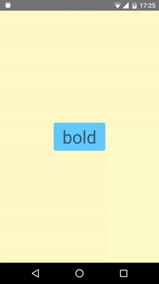

Title: Learning A Foreign Language
Date: 2016-01-21 17:20
Category: Travels
Tags: language, english, learning
Slug: learning-a-foreign-language
Authors: Romain Pellerin
Summary: My process I went through to learn a foreign language, English. And some tips.

Learning a foreign language is not easy whatsoever. In this article, I try to gather all the techniques and tips I used to learn a foreign language, English. I also put into perspective all those years spent learning. For the last couple of months, I made some research about languages. I'm actually really into being as fluent as possible in this language, my ideal goal would be being completely bilingual and sound like a native speaker (although some people might find the French accent "cute").

I was lucky enough to get taught English early, when I was around 9 or 10 years old. As of that period, I've never stopped having English classes. But as the world knows, French people really suck at English and disregard it completely. I would also add that our educational system regarding foreign languages is not that good. People don't get involved. It might be one of the reasons why our level is not as high as our European neighbors'. However, from a personal point a view, I've always been extremely interested in English, whereas I completely gave up Spanish after high school. English is the Wold language thus I see no point in learning a third language, despite Spanish might be more spread than French. What is more, English is ubiquitous in Computer Science.

A few years ago, right after graduating from high school, I started being even more interested in English, willing to work harder in order to improve my level. As I was heading towards Computer Science studies, I realized how important this language would be for me, in the long term. That was the starting point of my **English learning journey**. A sheer dive into that language.

# Stages

There are a few stages one has to go through during the process of learning a foreign language. What follows is about how English is taught in France.

## Education

The very first step is learning the basics, simple sentences, etc. That's what school is for. Being able to introduce yourself, talk about your family and interests, ask simple questions or get help from passers-by. That's basically what we learn in France in elementary school. At the end, pupils are supposed to have a A1 level (it's a European level). Then, comes middle school and more complex grammar. You get to know the tenses, and have dozens of irregular verbs to learn by heart. You also learn how to express common feelings or whishes and build conditional clauses. This will leave students with a B1 level. For the next three years of high school, teaching would continue, going a bit further, to finally reach a B2 level (supposedly, in facts most of people don't have such a level).

Then starts higher education. Students can choose freely to keep studying English or not, mostly depending on their studies. I did continue.

After that period, unless they were actually studying languages (or English), most people feel like they hadn't made huge progress over their college years. It seems like they've reached the peak and can no long make any significant progress. Of course you improve your vocabulary, you get used to new expressions, your general oral and reading comprehension increase a bit, but not that much. Unless you decide to take the bull by the horns, on your own.

## Active and passive vocabulary

It has been demonstrated that each individual has two categories of vocabulary for each language they know: **the active vocabulary and the passive one**. The latter is basically made of known words but that you wouldn't use normally, out of the blue. You know the definition or the meaning, you just don't use it. If you hear it or read it, you would understand. On the contrary, the active vocabulary includes all the — known — words you would daily — or often — use, either when talking or writing.

According to [this website](http://www.lingholic.com/how-many-words-do-i-need-to-know-the-955-rule-in-language-learning-part-2/), native English speakers have an average of 20.000 words in their active vocabulary whereas they have around 40.000 in their passive. This is a gigantic difference.

My guess is that all along your course to learn a foreign language, your two types of vocabulary evolve like this:

When you take up classes during childhood, your two kinds of vocabulary are mixed up. A some point they slightly fork, like after elementary school. Then, when you have your first experience abroad, your amount of passive and active vocabulary will usually soar. But still, the gap between the two of them increases, making an even bigger difference.

I personally reached that stage where I can fluently read an English book written by a journalist without having to look words up too frequently. And yet, my oral expression is not that good.

Consequently, the following parts of this article will then be dedicated to finding efficient and handy ways to reduce that growing gap.

# Let's code something

From September 2015, I'm having my longest experience abroad, taking place in the Netherlands, a country where **every single person** speaks English (which is really awesome for a French country boy like me).

In November, I decided to start writting down all the unknown vocabulary or expressions I would come across, in a text file. Then, as the file was growing bigger and bigger, I thought I needed something else. Going back through that long list would have been painful and not convenient. I needed something I could do wherever and whenever I want. Most of all, I wanted to keep a trace of my improvements.

I spent some time for reflection and I eventually came up with an idea: a mobile app. Indeed, I carry my smartphone everywhere and thus can use it at any time. I also thought that a Tinder-like app might just be perfectly suited for my need. The idea was to swipe left if the word was unknown, swipe right otherwise. The definition would appear on a swipe left.

With such an app, I would get exposed to my vocabulary list frequently, many times a day. The words swiped left would be more likely to appear often, whereas those swiped right would appear rarely.

Today, I'm proud to announce that the project is officially [available on Github](https://github.com/rpellerin/learn-a-foreign-language). It's open source, so feel free to contribute. Moreover, the app has been [published on the Android Play Store](https://play.google.com/store/apps/details?id=learnaforeignlanguage.eu.romainpellerin). Finally, [here is the website](http://learnenglishbackend-romainpellerin.rhcloud.com/) to create an account and add words or expressions to lists.

Let's now move on to other ways to reduce that gap between active and passive vocabulary.

# Reading

Reading is key to a drastic increase of your vocabulary. You stumble upon loads of unknown words, complex expressions, strange clauses and so on.

**Online newspaper** are a great solution to get used to expressions commonly written. Specialized newspapers are great as well to meet specific vocabulary.

Books (novels, journalists's books, comics) are other rich sources of knowledge and vocabulary. It might be of any kind but what's sure is that you will learn. I find comics really useful when it comes to learning some slang.

# Watching

TV series are the equivalent of comics: full of slang vocabulary, hardly enunciated, whereas movies are richer. Nonetheless, they are really efficient and most of the time they will teach you the correct pronounciation of unknown words. It's also easy to get acquinted to British and American accents.

One can alos watch the news. Journalists normally have a good pronounciation and use fairly simple vocabulary.

# Listening

The Internet is full of [high-quality podcasts](http://www.bbc.co.uk/podcasts), take advantage of them if you don't have much time to spend reading or watching.

# Writing

Finally, I need to mention writing. It's not well known, and that's a pity. But writing is one of the most efficient ways to put into practice what you daily learn and make sure you don't forget it. It's just like rehearsing. Write blog posts, write comments, send out emails, but get out of your comfort zone and do it in a foreign language!

If you have the opportunity, write reports in English as well, or give presentations in English, and so on. 

 

There's no frontier to knowledge, embrace a foreign language right now :-)

# Resources

[Here is a really good blog to go even further with foreign languages.](http://rawlangs.com/blog/) And the guy who owns the blog also gives talks sometimes, here is one from him, about reading comprehension:

<iframe width="700" height="394" src="https://www.youtube-nocookie.com/embed/xgQZfS_BMVo?rel=0" frameborder="0" allowfullscreen></iframe>

To conclude, try to [read this](http://www.thepoke.co.uk/2011/12/23/english-pronunciation/). Good luck!

## Going further with English

I decided to gather here all the little things to know in English, which are not obvious.

- [Idiom](https://en.wikipedia.org/wiki/Idiom)
- [What is the difference between trash, garbage, litter, rubbish, waste?](http://english.stackexchange.com/questions/272361/what-is-the-difference-between-trash-garbage-litter-rubbish-waste)
- [Pretty, fairly, really, very, and quite](http://www.learnersdictionary.com/qa/pretty-fairly-really-very-and-quite)
- [Difference between "almost" and "nearly"](http://www.editage.com/insights/scientific-writing-difference-between-almost-and-nearly)
- [Canceled vs. cancelled](http://grammarist.com/spelling/cancel/)
- ['at weekends' or 'on weekends'](http://forum.thefreedictionary.com/postst14228_-at-weekends--or--on-weekends-.aspx)
- [Difference between “chance” and “opportunity”](http://english.stackexchange.com/questions/32700/difference-between-chance-and-opportunity)
- [How do I use “as of now” correctly?](http://english.stackexchange.com/questions/194227/how-do-i-use-as-of-now-correctly)
- [from today on , as of today , starting today](https://www.italki.com/question/57702)
- [‘Learnt’ or ‘learned’?](http://www.oxforddictionaries.com/words/learnt-vs-learned)
- [Whatsoever Vs. Whatever](http://forum.wordreference.com/threads/whatsoever-vs-whatever.228376/)
- [can't help](http://idioms.thefreedictionary.com/can't+help)
- [Difference between “think of” and “think about”](http://english.stackexchange.com/questions/71003/difference-between-think-of-and-think-about)
- [What is the difference between revenue, income, and gain?](http://www.accountingcoach.com/blog/revenue-income-gain)
- [‘Dot’, ‘period’, ‘full stop’, and ‘point’ in English](https://jakubmarian.com/dot-period-full-stop-and-point-in-english/)
- [Difference between “slacks”, “pants”, and “trousers”?](http://english.stackexchange.com/questions/79710/difference-between-slacks-pants-and-trousers)
- [Clause, phrase and sentence](http://learnenglish.britishcouncil.org/en/english-grammar/clause-phrase-and-sentence)
- [given that , provided that ,on condition that ?](http://forum.wordreference.com/threads/given-that-provided-that-on-condition-that.167673/)
- [What is the difference between a school, college and university in the USA?](https://studyusa.com/en/a/107/what-is-the-difference-between-a-school-college-and-university-in-the-usa)
- [“Through” vs “throughout.”](http://english.stackexchange.com/questions/137151/through-vs-throughout)
- [Had better / would rather](http://www.anglaisfacile.com/exercices/exercice-anglais-2/exercice-anglais-61575.php) & [Difference Between Rather Than, Would Rather, Had Rather and Had Better](http://www.myenglishteacher.eu/blog/difference-between-rather-than-would-rather-had-rather-and-had-better/)
- [No longer, not any longer](http://dictionary.cambridge.org/grammar/british-grammar/no-longer-not-any-longer)
- [Acknowledgement vs. acknowledgment](http://grammarist.com/spelling/acknowledgment-acknowledgement/)
- [Qualifiers](http://writingcenter.unc.edu/handouts/qualifiers/)
- [however / nevertheless / moreover](http://www.bbc.co.uk/worldservice/learningenglish/grammar/learnit/learnitv206.shtml)
- [Use of the verb: to help + verb](http://forum.wordreference.com/threads/use-of-the-verb-to-help-verb.895701/)
- [try and or try to](http://dictionary.reference.com/help/faq/language/g43.html)
- [Practice versus Training: Is there a difference?](http://thorstenconsulting.com/serendipity/index.php?/archives/197-Practice-versus-Training-Is-there-a-difference-Business-vs.-Sports.html)
- [Gerunds and Infinitives](http://www.gingersoftware.com/content/grammar-rules/nouns/gerunds-infinitives/)
- [What is the difference between taking courses, classes or lessons?](http://english.stackexchange.com/questions/33443/what-is-the-difference-between-taking-courses-classes-or-lessons)
- [(over) here/there](http://forum.wordreference.com/threads/over-here-there.2692066/)
- [Difference between “socket” and “outlet”](http://english.stackexchange.com/questions/42259/difference-between-socket-and-outlet)
- [passing vs having passed](http://ell.stackexchange.com/questions/18223/passing-vs-having-passed)
- [satisfying or satisfactory?](http://forum.wordreference.com/threads/satisfying-or-satisfactory.334680/)
- [in that](https://en.wiktionary.org/wiki/in_that)
- [Is this construct correct? “This one something…”](http://english.stackexchange.com/questions/91804/is-this-construct-correct-this-one-something)
- [Is it common to omit a preposition (in / on / of) before “the month (year / week /day) when they are used adjectively and adverbially?](http://english.stackexchange.com/questions/111217/is-it-common-to-omit-a-preposition-in-on-of-before-the-month-year-week)
- [“Outside” or “outside of”?](http://english.stackexchange.com/questions/9700/outside-or-outside-of) & [Outside of](http://grammarist.com/usage/outside-of/)
- [Lay vs. Lie (vs. Laid)](http://www.writersdigest.com/online-editor/lay-vs-lie)
- [“From then on” or “since then”?](http://english.stackexchange.com/questions/231026/from-then-on-or-since-then)
- [Difference between “smart” and “clever”](http://english.stackexchange.com/questions/46451/difference-between-smart-and-clever) & [Smart/clever/intelligent?](https://www.englishforums.com/English/SmartCleverIntelligent/xphvz/post.htm)
- ["Each Other" Versus "One Another"](http://www.quickanddirtytips.com/education/grammar/each-other-versus-one-another)
- [Is using the possessive 's correct in “the car's antenna”?](http://english.stackexchange.com/questions/1031/is-using-the-possessive-s-correct-in-the-cars-antenna)
- [Birds: What's are the differences between hawks, falcons, eagles, osprey and kites?](https://www.quora.com/Birds-Whats-the-difference-between-hawk-falcon-eagle-osprey-and-kite)
- ["Like" Versus "Such As"](http://www.quickanddirtytips.com/education/grammar/like-versus-such-as)
- [Question about the use of “in this spirit” expression](http://english.stackexchange.com/questions/266275/question-about-the-use-of-in-this-spirit-expression)
- [Why use “need not” instead of “do not need to”?](http://english.stackexchange.com/questions/29409/why-use-need-not-instead-of-do-not-need-to)
- [too much (an) effort](http://thegrammarexchange.infopop.cc/eve/forums/a/tpc/f/340600179/m/439104541)
- ["Aren't I lucky?" - is this correct?](https://www.reddit.com/r/grammar/comments/4ex0c5/arent_i_lucky_is_this_correct/)
- [Until now/up until now](http://forum.wordreference.com/threads/until-now-up-until-now.112779/)
- [“Then” at the end of a sentence](http://ell.stackexchange.com/questions/6868/then-at-the-end-of-a-sentence)
- [What is the difference between assessment and evaluation?](https://arc.duke.edu/documents/The%20difference%20between%20assessment%20and%20evaluation.pdf)
- [Compelling versus appealing](http://forum.wordreference.com/threads/compelling-versus-appealing.3045836/)
- [Grammar Girl : I.e. Versus E.g. :: Quick and Dirty Tips](http://www.quickanddirtytips.com/education/grammar/ie-versus-eg)
- [When to use inadvertently instead of accidentally or unintentionally?](https://www.reddit.com/r/EnglishLearning/comments/4m44zl/when_to_use_inadvertently_instead_of_accidentally/)
