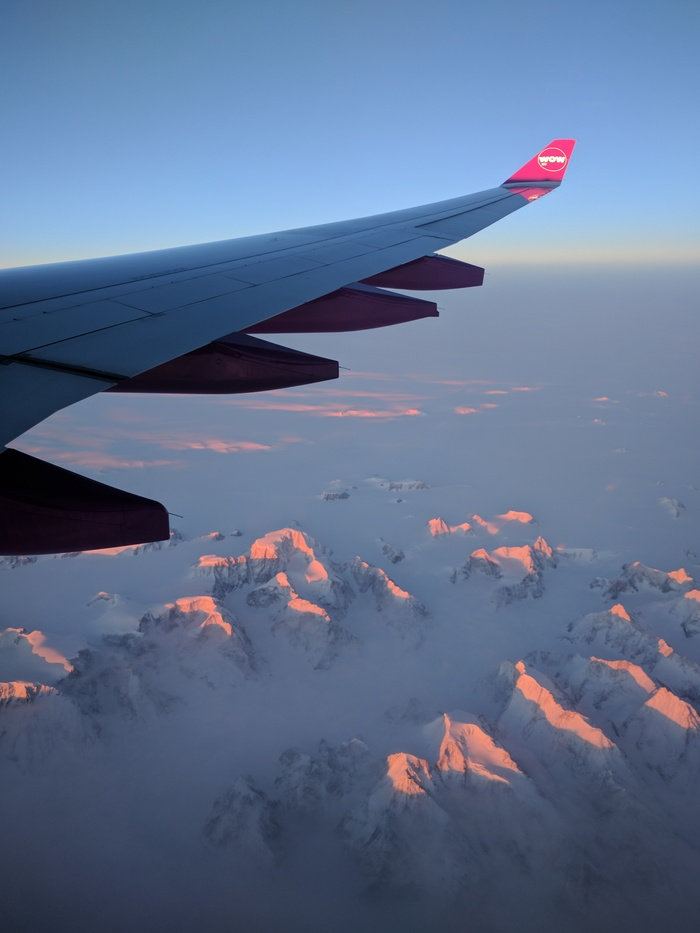

Title: Living In The USA
Date: 2017-01-30 16:55
Category: Miscellaneous
Tags: housing, usa, living
Slug: living-in-the-usa
Authors: Romain Pellerin
Summary: My life in the USA since I moved there in January 2017.
Image: living-usa.jpg

*This is a draft article.*

**Friday, January 27, 2017**: I took off from Paris CDG, headed to San Francisco, California. I traveled with WOW Air and had a 2-hour layover in Iceland. We flew over Greenland and Northern Canada. Stunning landscapes!

<figure class="center">

<figcaption>Greenland</figcaption>
</figure>

<figure class="center">

<figcaption>Northern Canada</figcaption>
</figure>

As I am writing these lines, I already moved in in my new home for the next 6 months: a room in a shared apartment, located between the University of San Francisco and the [Painted Ladies](https://en.wikipedia.org/wiki/Painted_ladies). We are only two people living in this apartment. The neighborhood is mostly residential. I am close to many grocery stores, very convenient! Moreover, there is an awesome neighborhood located within a walkable distance, called Hayes Valley, which is supposedly the French neighborhood. Indeed, there is a significant number of French businesses (restaurants, a *boulangerie*, etc.). The area is known for its artistic shops.

So, what's the purpose of my trip there? Well, I will be interning at a French company who recently (2013) opened offices in San Francisco to expand their business. This internship is the last step required for me to graduade.

In this article, I will explain and describes my daily life there. Hence, this article will be updated on a regular basis.

# Places I want to visit/Things I want to do while I'm there

## In San Francisco

- Go see whales
- A jazz club (likely to be [Madrone Art Bar](http://www.madroneartbar.com/))
- Explore the golden gate park (especially the Japanese stuff)
- Walk on the Golden Gate Bridge
- Attend a baseball game
- Go to a concert venue
- Attend an ice hockey match
- Chinatown
- Japantown (although I already had a glance at it)
- Union Square
- Grand Hyatt (Love sign)
- Twin Peaks
- Mission Dolores Park
- Baker Beack
- Bernal Heights Park

## Los Angeles

- The pier which appeared in La La Land
- The jazz clubs from La La Land
- Long Beach
- SpaceX (Hawthorne)
- Malibu

## Other

- Stanford University
- Yosemite National Park
- Brice Canyon
- Zion National Park
- Sequoia National Forest

# Cell phone plans

Expensive!!! I think I'll go with MetroPCS since they have a $30 plan. So far the cheapeast I found with a decent amount of Internet data.

# Housing

- Best of all: [www.craigslist.com](http://www.craigslist.com/)
- [www.easyroommate.com](http://www.easyroommate.com/)

# Bedding

A hassle. To be continued... Will talk about sizes (King, Queen, Full, etc.), vocabulary, differences with France.

# Grocery shopping

To be written. Will talk about: too many choices. Target, pharmacies (confusing btw), Trader Joe's, taxes, California Refund Value.
